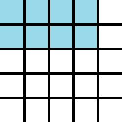
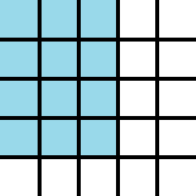
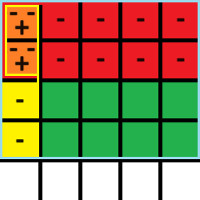

# sub_matrix_max_sum

## Description

Given an N x N square matrix with both positive and negative integer values in the cells, find the sub-matrix with the maximum sum for its integers.

## Approach

In an N x N square matrix there are ((N(N+1))/2)^2 sub-matrices.  Of these, N^2 are origin sub-matrices, i.e. their (top , left) values are all (0,0).

For N = 5, here is the origin sub-matrix {top = 0, bottom = 1, left = 0, right = 3}.

And here is the origin sub-matrix {top = 0, bottom = 3, left = 0, right = 2}.

The sum of all the integers in these origin sub-matrices can be described as the prefix sums.

The prefix sum of a sequence of numbers x0, x1, x2, ... is a second sequence of numbers y0, y1, y2, ..., the sums of prefixes (running totals) of the input sequence.  See [Prefix sum](https://en.wikipedia.org/wiki/Prefix_sum).

We first iterate across all cells and compute the sum for all the origin sub-matrices.  These will be the prefix sums.  Then we can compute the sums of all the other sub-matrices with a formula involving just these prefix sums.

sum[t, b, l, r] = sum(0, b, 0, r) - (sum[0, t-1, 0, r] + sum[0, b, 0, l-1]) + sum(0, t-1, 0, l-1)

For the sub-matrix {top = 2, bottom = 3, left = 1, right = 4}.

sum[2, 3, 1, 4] = sum(0, 3, 0, 4) - (sum[0, 1, 0, 4] + sum[0, 3, 0, 0]) + sum(0, 1, 0, 0)

green = blue - (red + yellow) + orange

